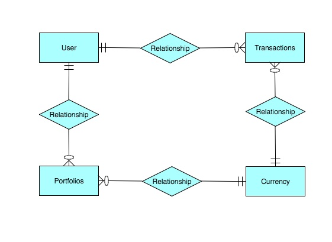
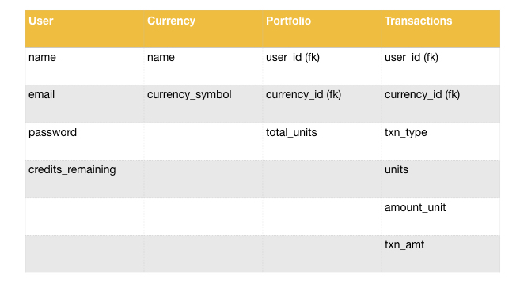
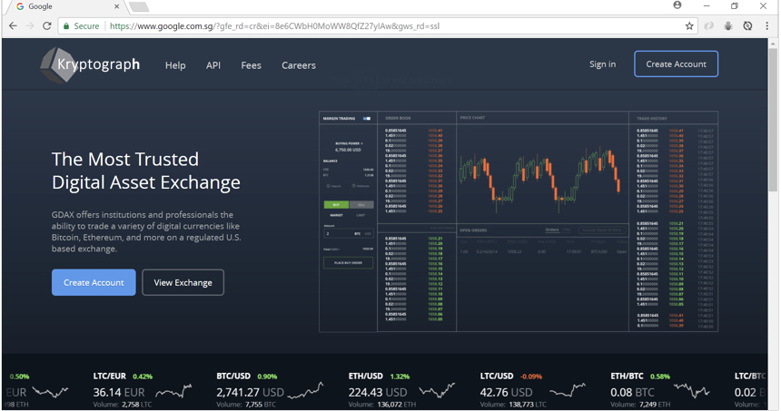
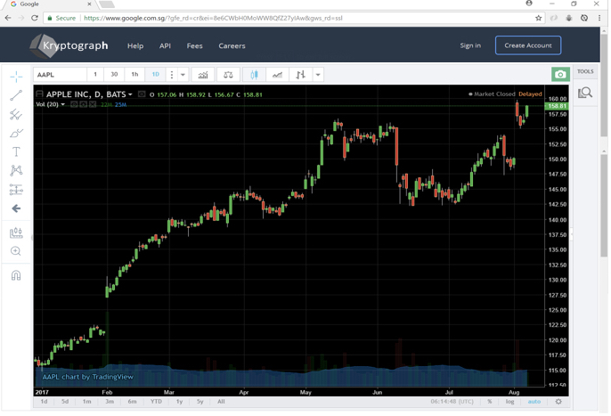
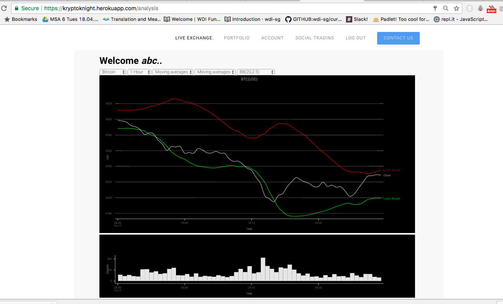
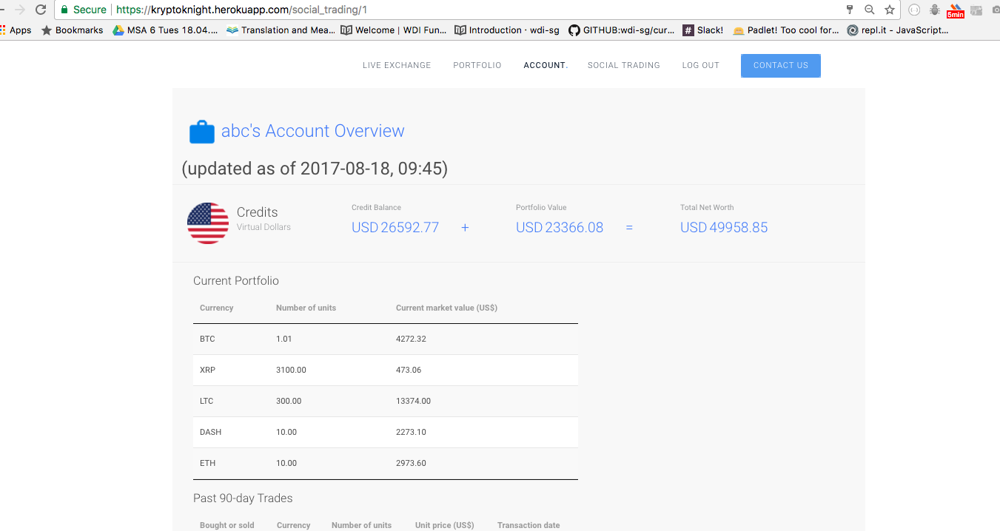
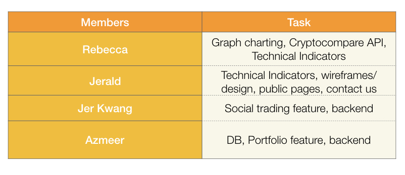
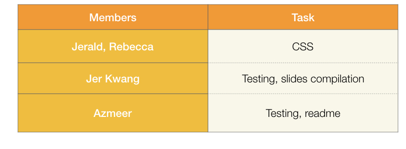
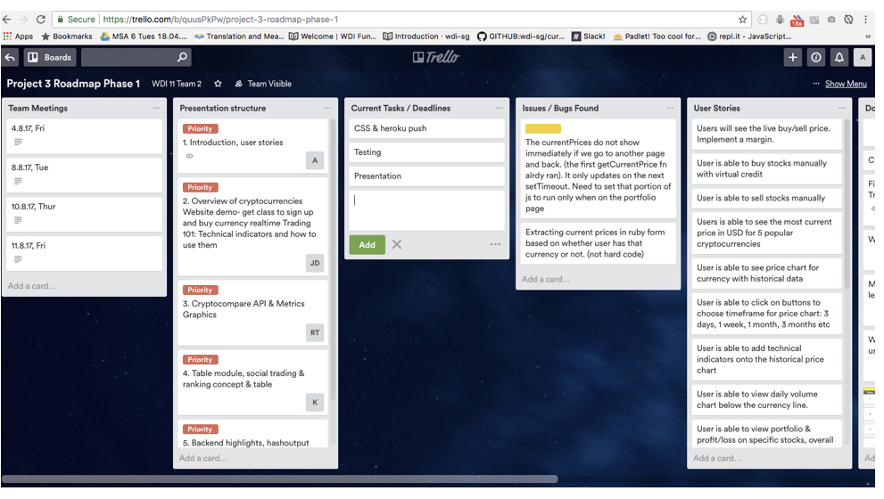

# KryptoKnight

A cryptocurrency analysis & trading tool which allow users to view other users’ portfolios and transactions.

## User Stories

* View price and volume stats of 5 cryptocurrencies
  - Bitcoin, Ethereum, Ripple, Litecoin, DASH
* View technical indicators such as Bollinger Bands against currency price
* Simulated trading of cryptocurrencies with virtual US$
* User portfolio of cryptocurrencies
* View user past transactions
* View ranking of fellow traders by 'Most Active'
* View portfolio and past transactions of fellow traders and learn/ mimic their trading strategies/ results

## ERD

## Model Schemas

## Wireframes

* Conceptualized product

* Actual product

## How to Use

1. Run bundle install:
2. If customizing metricsgraphics styling (eg: specifying background colors, line thickness etc), fork the gem 'metrics-graphics-rails' on GitHub. Modify the css stylesheet as needed. Modify the Gemfile to `'metrics-graphics-rails', :git => 'your forked gem repo url'`

## Challenges (Resolved!)

- Time conversion from server to local computer time
- Customizing chart for dark backgrounds

## Features we wished we could have included for this Version

- Realtime update on cryptocurrency prices
- Chat feature with other traders
- User guide on the website, FAQs section
- Email to confirm account upon registering

## Future Improvements
- Use of ActionCable to update prices without the use of a page refresh
- Actual trading Site with a different business model
- Automated algorithmic trading
- Scale up number of cryptocurrencies & technical indicators
- Greater statistical analysis of portfolio
- Social trading to have more features: follow, chat with fellow traders
- Using more powerful charting library such as D3, for a greater variety of visual representation

## Working in a Team
- Phase 1

- Phase 2

* Feature driven development approach was utilised throughout the project. This increased efficiency; the clean delegation ensured members were clear on their roles and reduced difficulties during merging of files.

* Other techniques in the AGILE development such as pair programming and daily scrums were used.

* Trello was utilised to keep track of tasks and assist in project management.

## Live Version

https://kryptoknight.herokuapp.com

## Built With

* HTML, JS, CSS
* jQuery
* jQuery data tables
* Ruby on Rails
* CryptoCompare API
* Graphing Module: MetricsGraphics.js

## Authors

* **Jerald** - *Responsible for wireframing, finance knowledge, HTML, CSS* - [karl-x](https://github.com/karl-x)
* **Jer Kwang** - *Responsible for Social Trading, jQuery data table* - [kepler62f](https://github.com/kepler62f)
* **Rebecca** - *Responsible for Analysis, Cryptocompare API integration, GraphicsMetrics, Technical indicators * - [rebeccatay92](https://github.com/rebeccatay92)

## Acknowledgments

* WDI 11 Tutor Prima Aulia & teaching assistant Shimei for the constant guide and encouragement.
